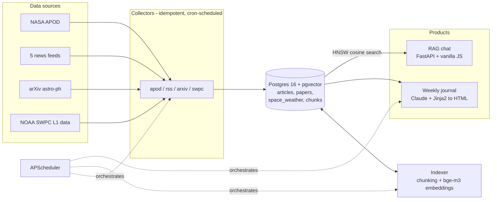

# Observatory

A personal astronomy aggregator that ingests daily space news, arXiv papers, and space-weather data into a local database, generates a weekly HTML magazine, and answers questions via a RAG chat backed by pgvector.

 

---

I wanted two things: a weekly astronomy digest that reads like a magazine instead of a firehose of feeds, and the ability to ask "what's new about exoplanets?" and get an answer grounded in real sources — not a hallucination.

So Observatory ingests five space-news feeds, arXiv astro-ph papers, NASA's Astronomy Picture of the Day, and NOAA solar-wind measurements into Postgres every day. Once a week an LLM acts as the magazine editor: it reads the entire week, picks the top stories, explains a few papers in plain words, summarizes space weather, and renders a self-contained HTML issue where **every claim links to its source**. The same archive powers a RAG chat that cites sources by number — and honestly says "I don't know" when the corpus doesn't cover a question.

*Live demo coming with the VPS deployment — see Roadmap. Until then: clone and run locally in ~10 minutes (instructions below).*

## Architecture



The data path in one sentence: collectors pull raw items into Postgres; the indexer chunks texts and stores 1024-dim bge-m3 embeddings next to them; the journal generator hands a numbered week's corpus to Claude and renders its structured answer to HTML; the chat embeds your question, walks the HNSW index for the nearest chunks, and asks Claude to answer *only* from them, citing by number.

## Technology choices — and why

| Technology | Why this and not the alternative |
|---|---|
| **Postgres + pgvector (HNSW)** | One database for both relational data and vector search. At thousands-of-chunks scale a dedicated vector DB adds ops burden without speed gains — and pgvector joins chunks to their source articles in a single SQL query. |
| **Raw SQL via psycopg, no ORM** | Four tables, a repository layer as the single SQL entry point. The vector operator `<=>` and `EXPLAIN ANALYZE` stay visible instead of hidden behind an abstraction. |
| **Raw Anthropic SDK (Phase 1)** | The current pipeline is linear (question → search → answer), so direct SDK calls keep chunking, retrieval, and citation handling fully visible (~300 lines). LangGraph arrives in Phase 2, where real agent loops (re-query, source routing) justify a framework. |
| **bge-m3 embeddings** | Strong open model; the name lives in config so swapping models for an eval-driven comparison is a one-line change. |
| **FastAPI + vanilla JS chat** | The API layer is deliberately thin; no build step, one self-contained HTML page. |
| **APScheduler** | Single-process cron with coalescing for laptop sleep. Airflow would be a cannon aimed at a sparrow (until Phase 3). |
| **Docker Compose** | Postgres+pgvector with zero install pain, the same artifact that will ship to a server later. |

## Evaluation

The RAG pipeline ships with a hand-labeled eval set ([`tests/eval_questions.json`](tests/eval_questions.json)): retrieval questions with expected documents (for Recall@8/MRR scoring) and abstention questions the corpus must *refuse* — including full refusal, partial refusal ("nothing about Toronto, but here's what the sources do say about eclipses"), and intent-mismatch (corpus full of telescopes, question asks for buying advice). Every real question asked through the chat grows the set.

## Run it yourself

Prerequisites: Python 3.12+, [uv](https://docs.astral.sh/uv/), Docker. You'll need a free [NASA API key](https://api.nasa.gov) and an [Anthropic API key](https://console.anthropic.com) (journal generation ≈ $0.12/issue, one chat answer ≈ $0.02).

```bash
git clone https://github.com/dianaburia/skydigest.git && cd skydigest
uv sync                                  # installs deps (~800 MB incl. PyTorch)
docker compose up -d                     # Postgres+pgvector, schema auto-applied
cp .env.example .env                     # then put your two API keys inside

# first data collection (a few minutes)
uv run python -m observatory.ingest.apod
uv run python -m observatory.ingest.rss
uv run python -m observatory.ingest.arxiv 3
uv run python -m observatory.ingest.swpc
uv run python -m observatory.rag.indexer # first run downloads the 2 GB bge-m3 model

# products
uv run python -m observatory.journal.generate   # writes output/issue-YYYY-MM-DD.html
uv run uvicorn observatory.api.main:app         # chat at http://localhost:8000

# or let the scheduler run everything on cron
uv run python -m observatory.scheduler --kick
```

Tests: `uv run pytest` (33 tests: format parsers, chunking boundaries, repository idempotency against live Postgres, API contract).

## Roadmap

- **Next up:** GitHub Actions CI with a pgvector service container; a Recall@8/MRR evaluation script over the labeled set; embedding-based deduplication of stories covered by multiple feeds; public deployment of the compose stack to a VPS (with rate limiting before the chat goes public — anonymous questions spend real API credits).
- **Phase 2:** Next.js frontend, agentic chat on LangGraph (re-query loops, source-type routing), an MCP server exposing the archive to any AI client.
- **Phase 3:** ML on the accumulated space-weather data — an aurora/Kp forecasting model trained on raw L1 time series (the reason those measurements are collected from day one); Airflow; server deployment.
- **Phase 4:** fine-tuned science-communicator model (LoRA/SFT).
